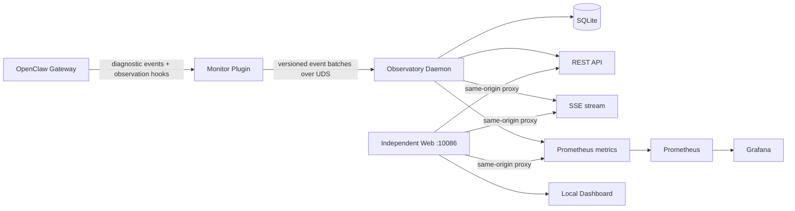

# OpenClaw Observatory

**English** | [中文](README.zh.md)

> A local-first observability platform for OpenClaw runtime, resource usage,
> agent execution, LLM calls, and tool activity.

OpenClaw Observatory turns OpenClaw's privacy-safe diagnostic events into a
queryable local timeline. A small in-process plugin forwards bounded metadata to
an independent Go daemon over a Unix domain socket. The daemon validates,
deduplicates, reduces, and stores events in SQLite, samples host process
resources, and exposes a localhost REST/SSE/Prometheus surface.

The project complements OpenClaw's official Prometheus and OpenTelemetry
exporters. Its focus is high-cardinality local detail—sessions, runs, model
calls, tool calls, and resource history—which must not be stored in Prometheus
labels.


## Status

**v0.4 — Operational Hardening.** The repository contains:

- a versioned event contract and JSON Schema;
- an OpenClaw plugin for OpenClaw `2026.6.11+`;
- a Go daemon (v0.4) with SQLite, resource sampling, REST, SSE, and Prometheus output;
- a rich dashboard with 12 chart modules, real-time SSE updates, and PWA support;
- configurable data retention with background cleanup;
- cursor-based pagination for all list endpoints;
- URL state sync for shareable dashboard links;
- cost trend analysis with budget alerts and OpenRouter pricing integration;
- Prometheus/Grafana provisioning and initial alert rules.

The current adapter is verified against OpenClaw `2026.6.11` on macOS. Linux
process sampling is an architectural extension point, not part of this
macOS-first MVP.

## Features

### Dashboard

The built-in dashboard provides 12 configurable modules with drag-and-drop
ordering, dark/light themes, and localStorage persistence:


- **Core KPI cards** — Agent runs, LLM requests, token usage, tool calls,
  average latency, cost, and disk usage with threshold-based highlighting.
- **Resource trends** — CPU %, memory RSS, disk usage, and thread/FD counts
  over time.
- **LLM combo chart** — Request volume, average latency, and error rate in a
  single multi-axis view.
- **Per-model token trends** — Stacked area chart showing token consumption
  across different LLM models.
- **Token / Tool distribution** — Doughnut charts for quick share comparison.
- **LLM latency–token scatter** — Correlate response time with token counts
  per model.


- **Agent comparison table** — Runs, tokens, tools, duration, error rate, and
  cost per agent.
- **Time × Agent activity heatmap** — Visualize when each agent is most active.
- **Session waterfall** — Detailed LLM, Tool, MCP, and Subagent timeline for
  each session.


- **Error aggregation** — Grouped by source and category with last-occurred
  timestamps.
- **Model cost breakdown** — Per-model requests, tokens, and reported cost.
- **Subagent / MCP activity** — Dedicated views for nested agent and MCP calls.


- **Cost trend analysis** — Daily, weekly, and monthly cost breakdown by model
  with stacked bar charts.
- **Budget alerts** — Configurable cost threshold with visual warning when
  spending approaches the limit.
- **OpenRouter pricing** — Auto-fetch model pricing for accurate cost estimates.

### Settings & Configuration


- Toggle module visibility and reorder via drag-and-drop.
- Configurable auto-refresh interval (5s / 15s / 30s / 60s / off).
- Adjustable threshold values for error rate and latency warnings.
- JSON-based configuration with import/export.
- One-click pricing refresh from OpenRouter.

### Platform Features

- **PWA support** — Installable on mobile/desktop with offline manifest and
  service worker.
- **Mobile responsive** — Adaptive layout with safe-area insets for notch
  devices. Pinch-zoom disabled for app-like feel.
- **SSE incremental updates** — Charts update in-place without full re-render,
  eliminating flicker.
- **URL state sync** — Time range, filters, and selected session are encoded in
  the URL for easy sharing.
- **Cursor pagination** — Efficient pagination across all list endpoints using
  opaque base64 cursors.
- **Data retention** — Configurable retention periods for events, resource
  samples, and all data with background cleanup every 6 hours.
- **Cloudflare Tunnel ready** — Deploy securely behind Cloudflare Access
  without exposing ports.

## Architecture



The plugin never opens SQLite, samples system resources, aggregates metrics, or
waits synchronously for the daemon. The daemon is the only database writer and
the source of truth for query state.

## Components

| Component | Location | Responsibility |
| --- | --- | --- |
| Monitor plugin | `plugin/` | Adapt OpenClaw diagnostics and observation hooks into bounded events |
| Agent Skill and Tool | `plugin/skills/`, `observatory_query` | Let agents read and explain local Observatory metadata safely |
| Daemon | `cmd/observatoryd`, `internal/` | Receive, validate, deduplicate, reduce, persist, sample, and expose APIs on `:10087` |
| Event contract | `schemas/` | Draft 2020-12 envelope and payload limits |
| Local dashboard | `web/`, `cmd/observatory-web` | Vite-built UI served independently with same-origin API/SSE proxying |
| Monitoring stack | `deploy/` | Optional Prometheus and Grafana deployment |

## Quick start

Requirements: macOS, Go 1.24+, Node.js 22+, and OpenClaw `2026.6.11+`.

```bash
# Build the frontend and both local services
npm ci --prefix web --include=dev
VITE_BUILD_ID=dev npm run build --prefix web
go test ./...
go build -o ./bin/observatoryd ./cmd/observatoryd
go build -o ./bin/observatory-web ./cmd/observatory-web

# Start the API and web processes in separate terminals
./bin/observatoryd --listen 127.0.0.1:10087
./bin/observatory-web --web-root ./web/dist --backend http://127.0.0.1:10087

# In another terminal, install/link and enable the plugin
openclaw plugins install --link ./plugin
openclaw plugins enable openclaw-observatory
openclaw gateway restart
```

The service runs natively on macOS; Docker is not required. Then open
<http://127.0.0.1:10086/> or query:

```bash
curl http://127.0.0.1:10086/health
curl http://127.0.0.1:10086/api/v1/status
curl http://127.0.0.1:10086/api/v1/events?limit=20
curl http://127.0.0.1:10086/metrics
```

Runtime data defaults to `~/.openclaw-observatory/`:

- `observatory.sock` — plugin-to-daemon Unix socket (`0600`);
- `observatory.db` — SQLite database;
- `logs/` — backend and web-service logs.

Versioned frontend releases are installed under
`~/.local/share/openclaw-observatory/web/`; switching the `current` symlink
publishes a frontend build without embedding it into the daemon binary.
After the initial service installation, `scripts/publish-web.sh` builds and
switches only the frontend release without rebuilding or restarting the daemon.

For per-user macOS background services, run `scripts/install-local.sh`. It
builds the Vite frontend, API daemon, and web proxy; installs two LaunchAgents;
runs database migrations; verifies frontend/backend compatibility; links the
plugin; and restarts the Gateway. Use `scripts/uninstall-local.sh` to remove the
services; the database is preserved unless explicitly deleted.

Once the plugin is enabled, OpenClaw also discovers the `openclaw-observatory`
Skill and read-only `observatory_query` Tool. Agents can answer requests such as
"check whether OpenClaw is healthy," "show recent failed Tool calls," or
"explain the memory trend" through the localhost service without direct SQLite
access. The Tool is fixed to `127.0.0.1:10086`, uses GET requests only, caps
query size, and cannot restart services or modify data.

## Optional Prometheus and Grafana

This is optional and is not used by the native service installation. If an
operator separately wants Prometheus/Grafana in containers, first expose only
the metrics listener to a trusted Docker-reachable address, then run:

```bash
docker compose -f deploy/docker-compose.yml up -d
```

Docker Desktop scrapes `host.docker.internal:10086`. The daemon binds only to
`127.0.0.1` by default, so container scraping is intentionally opt-in: start it
by binding `observatory-web --listen 0.0.0.0:10086` only behind a trusted host
firewall, or run Prometheus directly on the host. The REST API contains local
operational identifiers and must not be exposed to an untrusted network.

## API summary

| Endpoint | Purpose |
| --- | --- |
| `GET /health`, `GET /ready` | Liveness and readiness |
| `GET /metrics` | Low-cardinality Prometheus exposition |
| `GET /api/v1/status` | Gateway, daemon, database, and queue summary |
| `GET /api/v1/instances` | Observed OpenClaw instances |
| `GET /api/v1/sessions[/{id}]` | Session list and waterfall detail |
| `GET /api/v1/runs[/{id}]` | Agent run list/detail |
| `GET /api/v1/agents/stats` | Agent comparison statistics |
| `GET /api/v1/subagents`, `GET /api/v1/mcp/calls` | Subagent and MCP detail |
| `GET /api/v1/timeseries` | SQLite-bucketed historical trends |
| `GET /api/v1/errors/stats` | Errors grouped by source/category |
| `GET /api/v1/resources` | Resource samples |
| `GET /api/v1/tools/stats` | Aggregated tool statistics |
| `GET /api/v1/models/stats` | Aggregated model statistics |
| `GET /api/v1/cost/trends` | Daily/weekly/monthly cost breakdown by model |
| `GET /api/v1/cost/summary` | Aggregate cost with day/week/month rolls |
| `GET /api/v1/events` | Filtered raw metadata events (cursor pagination) |
| `GET /api/v1/stream` | One-way SSE event stream |

All collection and query timestamps are UTC RFC3339. List endpoints accept
`limit`, `cursor`, `from`, `to`, `instanceId`, and `agentId` where applicable.
See [`docs/070-api-design.md`](docs/070-api-design.md).

## Privacy and security

- Content capture is off by design. When conversation-hook access is explicitly
  enabled, the plugin copies only normalized numeric usage from `llm_output`;
  it never forwards prompts, responses, or private diagnostic payloads.
- Session keys are hashed before leaving the plugin. Raw user/chat identifiers,
  Prompt text, Tool parameters/results, paths, commands, and error messages are
  excluded.
- The plugin queue is bounded, asynchronous, and fail-open. When full it drops
  low-priority events first and emits a drop counter.
- UDS and database files live in a user-private directory. Public HTTP binds are
  opt-in and should be protected by host firewall rules.
- Prometheus labels never contain session, run, request, prompt, path, or error
  text. Tool/model values are normalized and capped.

This is observability software, not a security boundary. A local process running
as the same user can generally read that user's files and socket.

## Documentation

- [Overview](docs/000-overview.md)
- [Runtime model](docs/010-runtime-model.md)
- [Event model](docs/020-event-model.md)
- [Plugin design](docs/030-plugin-design.md)
- [Daemon design](docs/040-daemon-design.md)
- [Storage design](docs/050-storage-design.md)
- [Prometheus metrics](docs/060-prometheus-metrics.md)
- [REST and SSE API](docs/070-api-design.md)
- [Grafana dashboard](docs/080-grafana-dashboard.md)
- [Roadmap](docs/090-roadmap.md)

## Roadmap

- **Phase 0 — Architecture and Contracts** ✅ — Runtime model, event schema,
  metrics and API contracts.
- **Phase 1 — Local MVP** ✅ — Plugin, Go daemon, SQLite, metrics, process
  samples, and baseline dashboards.
- **Phase 2 — Product Dashboard** ✅ — Rich timeline, session waterfall,
  resource charts, error explorer, and configuration UI.
- **Phase 3 — Observability Enhancement** ✅ — Per-agent stats, time-series
  aggregation, heatmap, scatter, doughnut charts, and dashboard JSON config.
- **Phase 4 — Operational Hardening** ✅ — Data retention, SSE incremental
  updates, CI/CD, cursor pagination, URL state sync, and cost analysis.
- **Phase 5 — Advanced Observability** — Metadata replay, OpenTelemetry traces,
  Loki/Tempo integration, remote mode, and multi-instance operations.

Full replay of prompt/tool content is not implied by Phase 5. Any content mode
must be separately opt-in, bounded, redacted, encrypted, and documented.

## License

MIT. See [LICENSE](LICENSE).
