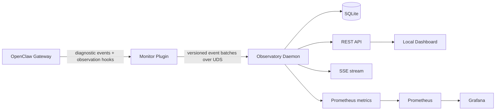

# OpenClaw Observatory

> A local-first observability platform for OpenClaw runtime, resource usage,
> agent execution, LLM calls, and tool activity.

OpenClaw Observatory turns OpenClaw's privacy-safe diagnostic events into a
queryable local timeline. A small in-process plugin forwards bounded metadata to
an independent Go daemon over a Unix domain socket. The daemon validates,
deduplicates, reduces, and stores events in SQLite, samples host process
resources, and exposes a localhost REST/SSE/Prometheus surface.

The project complements OpenClaw's official Prometheus and OpenTelemetry
exporters. Its focus is high-cardinality local detail—sessions, runs, model
calls, tool calls, and resource history—which must not be stored in Prometheus
labels.

## Status

**Local MVP.** The repository contains:

- a versioned event contract and JSON Schema;
- an OpenClaw plugin for OpenClaw `2026.6.11+`;
- a Go daemon with SQLite, resource sampling, REST, SSE, and Prometheus output;
- a small built-in dashboard;
- Prometheus/Grafana provisioning and initial alert rules.

The current adapter is verified against OpenClaw `2026.6.11` on macOS. OpenClaw
SDK compatibility outside that version range is detected at plugin load time but
has not yet been exhaustively tested. Linux process sampling is an architectural
extension point, not part of this macOS-first MVP.

## Goals

- Observe Gateway, Session, Agent Run, LLM, Tool, MCP, and Subagent lifecycles.
- Correlate semantic activity with host process CPU and memory.
- Keep detailed identifiers in SQLite and only bounded dimensions in metrics.
- Remain operational when OpenClaw or the Observatory daemon is unavailable.
- Capture no prompt, tool argument, tool output, shell command, or file content
  by default.
- Provide stable, versioned contracts that can survive OpenClaw SDK changes.

## Architecture



The plugin never opens SQLite, samples system resources, aggregates metrics, or
waits synchronously for the daemon. The daemon is the only database writer and
the source of truth for query state.

## Components

| Component | Location | Responsibility |
| --- | --- | --- |
| Monitor plugin | `plugin/` | Adapt OpenClaw diagnostics and observation hooks into bounded events |
| Agent Skill and Tool | `plugin/skills/`, `observatory_query` | Let agents read and explain local Observatory metadata safely |
| Daemon | `cmd/observatoryd`, `internal/` | Receive, validate, deduplicate, reduce, persist, sample, and serve |
| Event contract | `schemas/` | Draft 2020-12 envelope and payload limits |
| Local dashboard | `web/` | Lightweight status and recent-event UI served by the daemon |
| Monitoring stack | `deploy/` | Optional Prometheus and Grafana deployment |

## Quick start

Requirements: macOS, Go 1.24+, Node.js 22+, and OpenClaw `2026.6.11+`.

```bash
# Build and test the daemon
go test ./...
go build -o ./bin/observatoryd ./cmd/observatoryd

# Start it in the foreground
./bin/observatoryd

# In another terminal, install/link and enable the plugin
openclaw plugins install --link ./plugin
openclaw plugins enable openclaw-observatory
openclaw gateway restart
```

The service runs natively on macOS; Docker is not required. Then open
<http://127.0.0.1:10086/> or query:

```bash
curl http://127.0.0.1:10086/health
curl http://127.0.0.1:10086/api/v1/status
curl http://127.0.0.1:10086/api/v1/events?limit=20
curl http://127.0.0.1:10086/metrics
```

Runtime data defaults to `~/.openclaw-observatory/`:

- `observatory.sock` — plugin-to-daemon Unix socket (`0600`);
- `observatory.db` — SQLite database;
- `observatory.pid` — daemon PID file when managed by the install script.

For a per-user macOS background service, run `scripts/install-local.sh`. It
builds the daemon, installs a LaunchAgent, links the plugin, enables it, and
restarts the Gateway. Use `scripts/uninstall-local.sh` to remove the services;
the database is preserved unless explicitly deleted.

Once the plugin is enabled, OpenClaw also discovers the `openclaw-observatory`
Skill and read-only `observatory_query` Tool. Agents can answer requests such as
“check whether OpenClaw is healthy,” “show recent failed Tool calls,” or
“explain the memory trend” through the localhost service without direct SQLite
access. The Tool is fixed to `127.0.0.1:10086`, uses GET requests only, caps
query size, and cannot restart services or modify data.

## Optional Prometheus and Grafana

This is optional and is not used by the native service installation. If an
operator separately wants Prometheus/Grafana in containers, first expose only
the metrics listener to a trusted Docker-reachable address, then run:

```bash
docker compose -f deploy/docker-compose.yml up -d
```

Docker Desktop scrapes `host.docker.internal:10086`. The daemon binds only to
`127.0.0.1` by default, so container scraping is intentionally opt-in: start it
with `-listen 0.0.0.0:10086` only on a trusted host firewall, or run Prometheus
directly on the host. The REST API contains local operational identifiers and
must not be exposed to an untrusted network.

## API summary

| Endpoint | Purpose |
| --- | --- |
| `GET /health`, `GET /ready` | Liveness and readiness |
| `GET /metrics` | Low-cardinality Prometheus exposition |
| `GET /api/v1/status` | Gateway, daemon, database, and queue summary |
| `GET /api/v1/instances` | Observed OpenClaw instances |
| `GET /api/v1/sessions[/{id}]` | Session list/detail |
| `GET /api/v1/runs[/{id}]` | Agent run list/detail |
| `GET /api/v1/resources` | Resource samples |
| `GET /api/v1/tools/stats` | Aggregated tool statistics |
| `GET /api/v1/models/stats` | Aggregated model statistics |
| `GET /api/v1/events` | Filtered raw metadata events |
| `GET /api/v1/stream` | One-way SSE event stream |

All collection and query timestamps are UTC RFC3339. List endpoints accept
`limit`, `cursor`, `from`, `to`, and `instanceId` where applicable. See
[`docs/070-api-design.md`](docs/070-api-design.md).

## Privacy and security

- Content capture is off by design; the plugin never forwards OpenClaw private
  diagnostic payloads.
- Session keys are hashed before leaving the plugin. Raw user/chat identifiers,
  Prompt text, Tool parameters/results, paths, commands, and error messages are
  excluded.
- The plugin queue is bounded, asynchronous, and fail-open. When full it drops
  low-priority events first and emits a drop counter.
- UDS and database files live in a user-private directory. Public HTTP binds are
  opt-in and should be protected by host firewall rules.
- Prometheus labels never contain session, run, request, prompt, path, or error
  text. Tool/model values are normalized and capped.

This is observability software, not a security boundary. A local process running
as the same user can generally read that user's files and socket.

## Documentation

- [Overview](docs/000-overview.md)
- [Runtime model](docs/010-runtime-model.md)
- [Event model](docs/020-event-model.md)
- [Plugin design](docs/030-plugin-design.md)
- [Daemon design](docs/040-daemon-design.md)
- [Storage design](docs/050-storage-design.md)
- [Prometheus metrics](docs/060-prometheus-metrics.md)
- [REST and SSE API](docs/070-api-design.md)
- [Grafana dashboard](docs/080-grafana-dashboard.md)
- [Roadmap](docs/090-roadmap.md)

## Roadmap

- **Phase 0 — Architecture and Contracts:** runtime model, event schema, metrics
  and API contracts. Implemented.
- **Phase 1 — Local MVP:** plugin, Go daemon, SQLite, metrics, process samples,
  and baseline dashboards. Implemented for macOS; hardening continues.
- **Phase 2 — Product Dashboard:** richer timeline, session detail, resource
  charts, and error explorer.
- **Phase 3 — Advanced Observability:** metadata replay, OpenTelemetry traces,
  Loki/Tempo integration, remote mode, and multi-instance operations.

Full replay of prompt/tool content is not implied by Phase 3. Any content mode
must be separately opt-in, bounded, redacted, encrypted, and documented.

## License

MIT. See [LICENSE](LICENSE).
