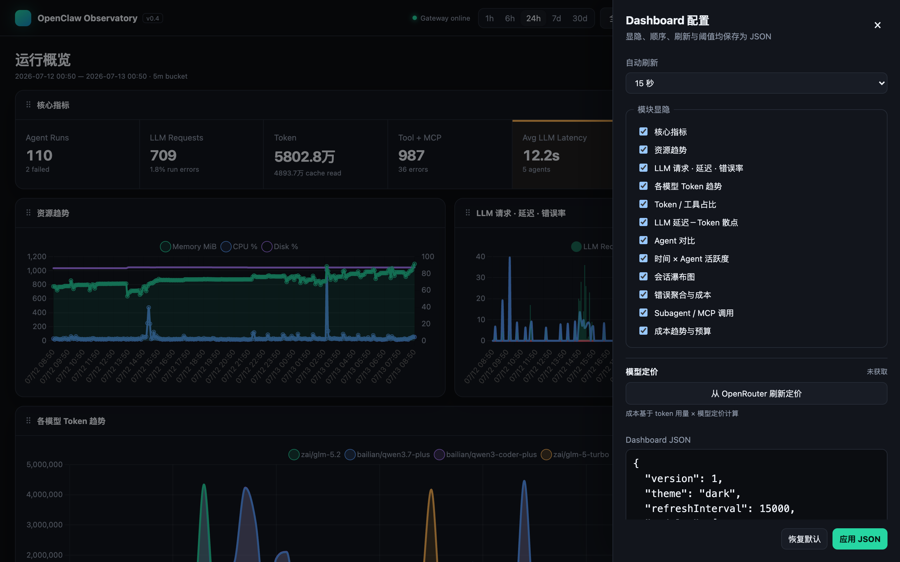
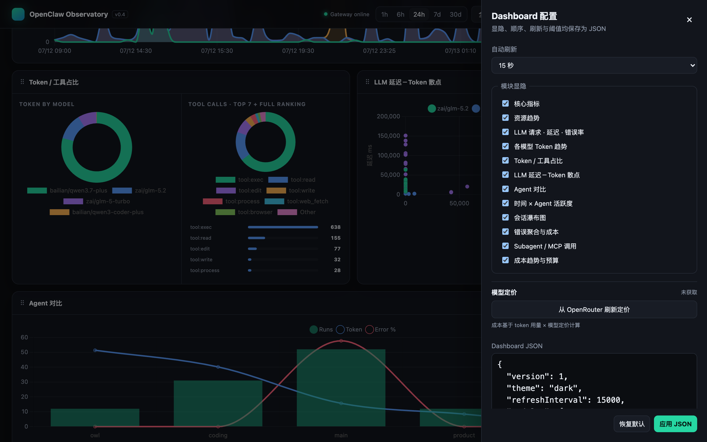
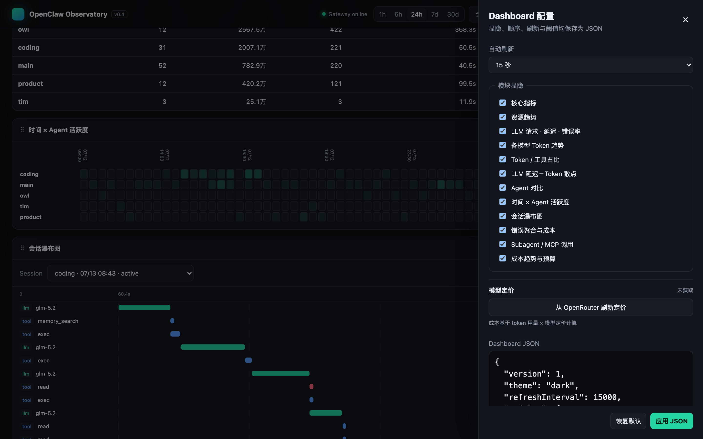
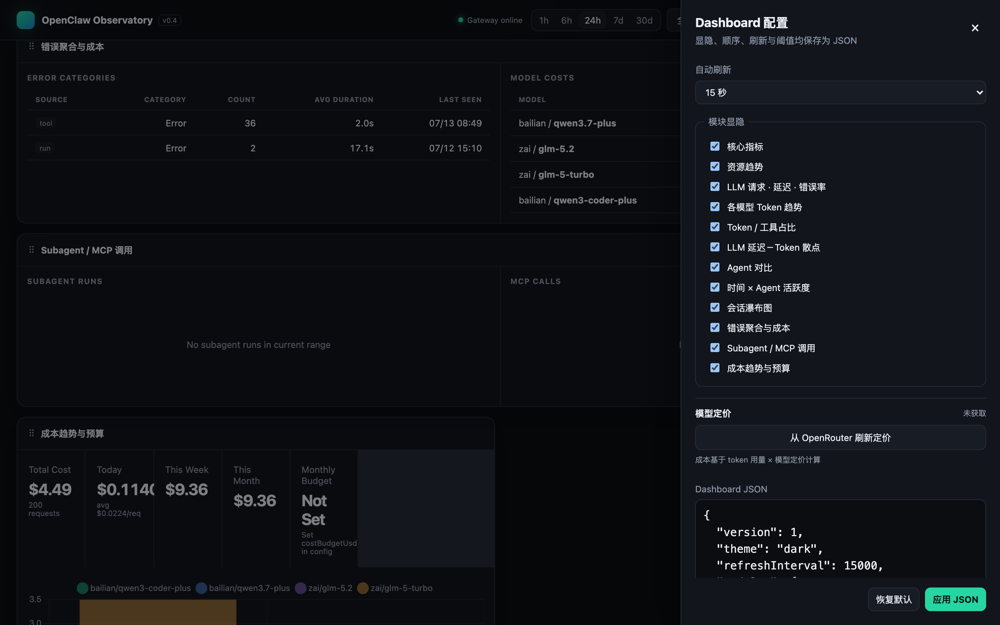
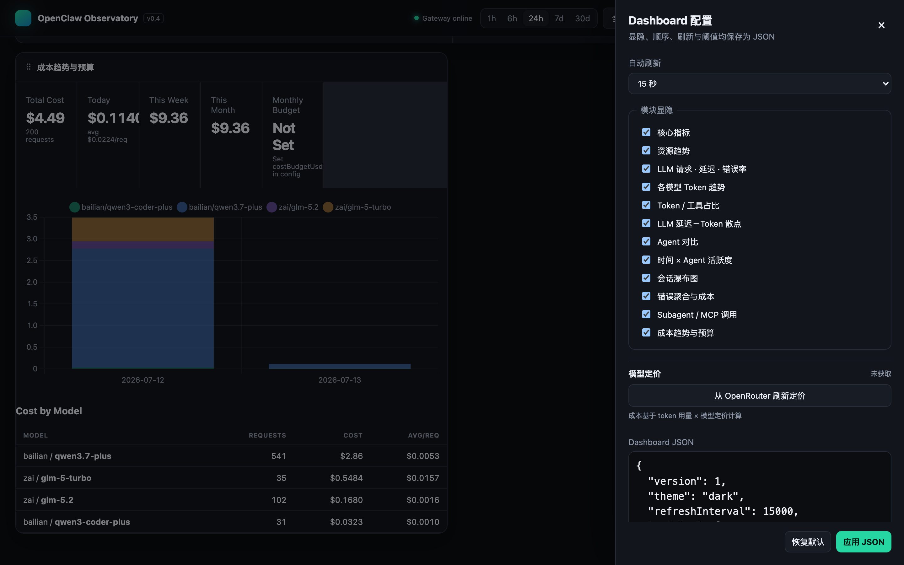
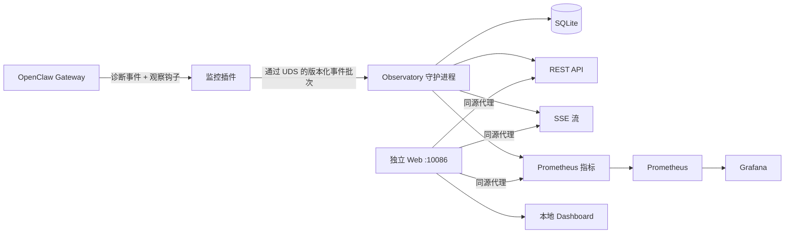

# OpenClaw Observatory

> 本地优先的可观测性平台，用于 OpenClaw 运行时、资源使用、Agent 执行、LLM 调用和工具活动。

[English](README.md) | **中文**

OpenClaw Observatory 将 OpenClaw 的隐私安全诊断事件转化为可查询的本地时间线。一个小型进程内插件通过 Unix Domain Socket 将有界元数据转发到独立的 Go 守护进程。守护进程负责校验、去重、归约，并将事件存储到 SQLite 中，同时采样宿主进程资源，通过 localhost REST/SSE/Prometheus 接口对外提供查询。

本项目是对 OpenClaw 官方 Prometheus 和 OpenTelemetry 导出器的补充，专注于高基数的本地细节——会话、运行、模型调用、工具调用和资源历史——这些数据不应存储在 Prometheus 标签中。



## 状态

**v0.4 — 运维加固。** 仓库包含：

- 版本化的事件契约和 JSON Schema；
- 适用于 OpenClaw `2026.6.11+` 的插件；
- Go 守护进程（v0.4），支持 SQLite、资源采样、REST、SSE、Prometheus 输出；
- 功能丰富的 Dashboard，含 12 个可配置图表面板、实时 SSE 推送和 PWA 支持；
- 可配置的数据保留策略与后台清理机制；
- 所有列表接口均支持游标分页；
- URL 状态同步，支持分享 Dashboard 链接；
- 成本趋势分析与预算告警，集成 OpenRouter 模型定价；
- Prometheus/Grafana 配置和初始告警规则。

当前适配器已在 macOS 上针对 OpenClaw `2026.6.11` 验证。Linux 进程采样属于架构扩展点，不包含在本 macOS 优先的 MVP 中。

## 功能特性

### Dashboard

内置 Dashboard 提供 12 个可配置面板，支持拖拽排序、暗色/亮色主题切换和 localStorage 持久化：



- **核心 KPI 卡片** — Agent 运行数、LLM 请求数、Token 用量、工具调用数、平均延迟、成本、磁盘使用量，支持阈值告警高亮。
- **资源趋势** — CPU%、内存 RSS、磁盘使用率、线程/FD 计数随时间变化曲线。
- **LLM 组合图** — 请求量、平均延迟和错误率在同一多轴视图中展示。
- **各模型 Token 趋势** — 堆叠面积图，展示不同 LLM 模型的 Token 消耗情况。
- **Token / 工具占比** — 环形图，直观对比各类资源的份额。
- **LLM 延迟－Token 散点图** — 关联响应时间与 Token 计数，按模型着色。



- **Agent 对比表格** — 按 Agent 展示运行数、Token、工具调用、持续时间、错误率和成本。
- **时间 × Agent 活跃度热力图** — 直观展示各 Agent 的时间分布。
- **会话瀑布图** — 详细展示每个会话的 LLM、工具、MCP 和子 Agent 调用时间线。



- **错误聚合** — 按来源和分类聚合，含最近发生时间。
- **模型成本明细** — 按模型展示请求量、Token 数和报告成本。
- **子 Agent / MCP 活动** — 专用的嵌套 Agent 和 MCP 调用视图。



- **成本趋势分析** — 按模型展示日/周/月成本分解，堆叠柱状图呈现。
- **预算告警** — 可配置成本阈值，超限时可视化警告。
- **OpenRouter 定价** — 自动获取模型定价，确保成本估算准确。

### 设置与配置


- 切换面板显隐，拖拽调整顺序。
- 可配置自动刷新间隔（5 秒 / 15 秒 / 30 秒 / 60 秒 / 关闭）。
- 可调整错误率和延迟的告警阈值。
- JSON 格式配置，支持导入导出。
- 一键从 OpenRouter 刷新模型定价。

### 平台特性

- **PWA 支持** — 可在手机/桌面安装，离线 Manifest 和 Service Worker。
- **移动端自适应** — 安全区域适配（刘海屏/Home 指示条），禁用双指缩放，原生应用体验。
- **SSE 增量更新** — 图表原地更新，无需全量重绘，消除闪烁。
- **URL 状态同步** — 时间范围、过滤器和选中会话编码到 URL，支持分享。
- **游标分页** — 所有列表接口使用不透明 base64 游标，高效分页。
- **数据保留** — 可配置事件、资源采样和全部数据的保留周期，后台每 6 小时清理。
- **Cloudflare Tunnel 就绪** — 可安全部署在 Cloudflare Access 后，无需暴露端口。

## 架构



插件从不直接操作 SQLite、采样系统资源、聚合指标或同步等待守护进程。守护进程是唯一的数据库写入者和查询状态的唯一来源。

## 组件

| 组件 | 位置 | 职责 |
| --- | --- | --- |
| 监控插件 | `plugin/` | 将 OpenClaw 诊断和观察钩子适配为有界事件 |
| Agent Skill 和工具 | `plugin/skills/`, `observatory_query` | 让 Agent 安全地读取和解释本地 Observatory 元数据 |
| 守护进程 | `cmd/observatoryd`, `internal/` | 接收、校验、去重、归约、持久化、采样，并在 `:10087` 提供 API |
| 事件契约 | `schemas/` | Draft 2020-12 信封和载荷限制 |
| 本地 Dashboard | `web/`、`cmd/observatory-web` | Vite 构建的独立 UI，通过同源代理访问 API/SSE |
| 监控栈 | `deploy/` | 可选的 Prometheus 和 Grafana 部署 |

## 快速开始

前置条件：macOS、Go 1.24+、Node.js 22+、OpenClaw `2026.6.11+`。

```bash
# 构建前端和两个本地服务
npm ci --prefix web --include=dev
VITE_BUILD_ID=dev npm run build --prefix web
go test ./...
go build -o ./bin/observatoryd ./cmd/observatoryd
go build -o ./bin/observatory-web ./cmd/observatory-web

# 分别在两个终端启动 API 和 Web 进程
./bin/observatoryd --listen 127.0.0.1:10087
./bin/observatory-web --web-root ./web/dist --backend http://127.0.0.1:10087

# 在另一个终端安装/链接并启用插件
openclaw plugins install --link ./plugin
openclaw plugins enable openclaw-observatory
openclaw gateway restart
```

服务原生运行在 macOS 上，无需 Docker。然后打开 <http://127.0.0.1:10086/> 或查询：

```bash
curl http://127.0.0.1:10086/health
curl http://127.0.0.1:10086/api/v1/status
curl http://127.0.0.1:10086/api/v1/events?limit=20
curl http://127.0.0.1:10086/metrics
```

运行时数据默认存储在 `~/.openclaw-observatory/`：

- `observatory.sock` — 插件到守护进程的 Unix socket（`0600`）；
- `observatory.db` — SQLite 数据库；
- `logs/` — 后端和 Web 服务日志。

带版本的前端发布存放在 `~/.local/share/openclaw-observatory/web/`，切换 `current` 软链接即可发布前端，无需将页面重新嵌入后端二进制。
首次安装服务后，运行 `scripts/publish-web.sh` 只会构建并切换前端发布，不会重新构建或重启守护进程。

运行 `scripts/install-local.sh` 可创建每用户的 macOS 后台服务。它会构建 Vite 前端、API 守护进程和 Web 代理，安装两个 LaunchAgent，执行数据库迁移并校验前后端兼容性，然后链接插件并重启 Gateway。使用 `scripts/uninstall-local.sh` 可移除服务；除非明确删除，数据库会被保留。

插件启用后，OpenClaw 还会发现 `openclaw-observatory` Skill 和只读 `observatory_query` 工具。Agent 可以通过 localhost 服务回答诸如"检查 OpenClaw 是否健康"、"显示最近的失败工具调用"或"解释内存趋势"等请求，无需直接访问 SQLite。该工具固定连接 `127.0.0.1:10086`，仅使用 GET 请求，有查询大小上限，不能重启服务或修改数据。

## 可选的 Prometheus 和 Grafana

此部分为可选项，本地服务安装不使用。如果运维人员需要在容器中运行 Prometheus/Grafana，先将指标监听器暴露到受信任的 Docker 可达地址，然后运行：

```bash
docker compose -f deploy/docker-compose.yml up -d
```

Docker Desktop 会抓取 `host.docker.internal:10086`。Web 服务默认仅绑定 `127.0.0.1`，因此容器抓取是显式开启的：仅在受信任的宿主防火墙后使用 `observatory-web --listen 0.0.0.0:10086` 启动，或直接在宿主上运行 Prometheus。REST API 包含本地运维标识符，不得暴露到不受信任的网络。

## API 概览

| 端点 | 用途 |
| --- | --- |
| `GET /health`, `GET /ready` | 存活和就绪检查 |
| `GET /metrics` | 低基数 Prometheus 导出 |
| `GET /api/v1/status` | Gateway、守护进程、数据库和队列摘要 |
| `GET /api/v1/instances` | 已观察的 OpenClaw 实例 |
| `GET /api/v1/sessions[/{id}]` | 会话列表/瀑布详情 |
| `GET /api/v1/runs[/{id}]` | Agent 运行列表/详情 |
| `GET /api/v1/agents/stats` | Agent 对比统计 |
| `GET /api/v1/subagents`、`GET /api/v1/mcp/calls` | Subagent 与 MCP 明细 |
| `GET /api/v1/timeseries` | SQLite 时间桶历史趋势 |
| `GET /api/v1/errors/stats` | 按来源/分类聚合错误 |
| `GET /api/v1/resources` | 资源采样 |
| `GET /api/v1/tools/stats` | 聚合工具统计 |
| `GET /api/v1/models/stats` | 聚合模型统计 |
| `GET /api/v1/cost/trends` | 按模型的日/周/月成本分解 |
| `GET /api/v1/cost/summary` | 含日/周/月汇总的聚合成本 |
| `GET /api/v1/events` | 过滤后的原始元数据事件（游标分页） |
| `GET /api/v1/stream` | 单向 SSE 事件流 |

所有集合和查询时间戳均为 UTC RFC3339。列表端点接受 `limit`、`cursor`、`from`、`to`、`instanceId` 和 `agentId`（如适用）。详见 [`docs/zh/070-api-design.md`](docs/zh/070-api-design.md)。

## 隐私和安全

- 内容捕获在设计上已关闭；插件从不转发 OpenClaw 私有诊断载荷。
- 会话密钥在离开插件前已被哈希。原始用户/聊天标识符、Prompt 文本、工具参数/结果、路径、命令和错误消息均被排除。
- 插件队列有界、异步、fail-open。队列满时优先丢弃低优先级事件并发出丢弃计数器。
- UDS 和数据库文件位于用户私有目录。公共 HTTP 绑定为显式开启，应受宿主防火墙保护。
- Prometheus 标签从不包含会话、运行、请求、Prompt、路径或错误文本。工具/模型值经过规范化和上限处理。

这是可观测性软件，不是安全边界。以同一用户身份运行的本地进程通常可以读取该用户的文件和 socket。

## 文档

- [架构概览](docs/zh/000-overview.md)
- [运行时模型](docs/zh/010-runtime-model.md)
- [事件模型](docs/zh/020-event-model.md)
- [插件设计](docs/zh/030-plugin-design.md)
- [守护进程设计](docs/zh/040-daemon-design.md)
- [存储设计](docs/zh/050-storage-design.md)
- [Prometheus 指标](docs/zh/060-prometheus-metrics.md)
- [REST 和 SSE API](docs/zh/070-api-design.md)
- [Grafana Dashboard](docs/zh/080-grafana-dashboard.md)
- [路线图](docs/zh/090-roadmap.md)

## 路线图

- **阶段 0 — 架构和契约** ✅ — 运行时模型、事件 Schema、指标和 API 契约。
- **阶段 1 — 本地 MVP** ✅ — 插件、Go 守护进程、SQLite、指标、进程采样和基线 Dashboard。
- **阶段 2 — 产品 Dashboard** ✅ — 丰富时间线、会话瀑布图、资源图表、错误浏览器和配置 UI。
- **阶段 3 — 可观测性增强** ✅ — 按 Agent 统计、时间序列聚合、热力图、散点图、环形图和 Dashboard JSON 配置。
- **阶段 4 — 运维加固** ✅ — 数据保留、SSE 增量更新、CI/CD、游标分页、URL 状态同步和成本分析。
- **阶段 5 — 高级可观测性** — 元数据回放、OpenTelemetry 追踪、Loki/Tempo 集成、远程模式和多实例运维。

阶段 5 并不意味着完整的 Prompt/工具内容回放。任何内容模式必须单独开启，经过有界、脱敏、加密和文档化处理。

## 许可证

MIT。详见 [LICENSE](LICENSE)。
