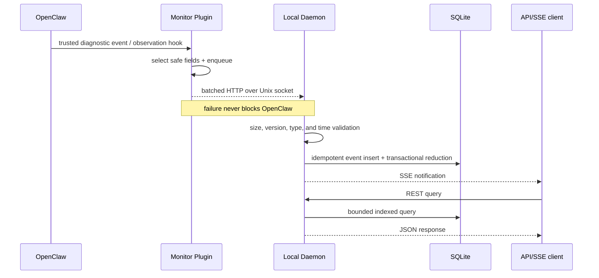

# Architecture Overview

## Scope

OpenClaw Observatory is a local metadata observability layer. It answers:

- Is the Gateway alive and making progress?
- Which sessions and agent runs are active, slow, failed, or incomplete?
- Which model and tool calls occurred, how long did they take, and what bounded
  accounting metadata was reported?
- What CPU and memory did the Gateway process consume during those activities?

It does not inspect or replay Prompt text, Tool input/output, file content, shell
commands, or provider secrets.

## Data flow

## Trust boundaries

1. OpenClaw private diagnostic data stays in-process and is never read.
2. The plugin emits only an explicit field allowlist.
3. The UDS directory and database are user-private; peers are still treated as
   untrusted and every event is validated.
4. The HTTP API defaults to loopback. Binding it publicly is an operator action.
5. Prometheus contains aggregates and bounded dimensions, never entity IDs.

## Availability model

The plugin has an in-memory queue and no disk dependency. Delivery is
at-most-retry with idempotent event IDs. The daemon provides effectively-once
database effects by inserting the event ID and applying reducers in one SQLite
transaction. The original emission remains at-least-once across transient
transport ambiguity.

An OpenClaw crash cannot emit a terminal event. The daemon therefore marks a
Gateway crashed when a known PID disappears or its heartbeat becomes stale. A
clean plugin shutdown emits `gateway.stopped`.

## Compatibility

The protocol is independent of OpenClaw. The adapter records its OpenClaw
version/capabilities at startup and maps only verified surfaces. Unknown
diagnostic events are ignored, not guessed. Current verified surfaces:

- diagnostics: run, model call, model usage, tool execution, heartbeat;
- typed observation hooks: session lifecycle and subagent lifecycle;
- plugin service lifecycle: Gateway start/stop.

MCP is mapped only when OpenClaw reports `toolSource: "mcp"`.
