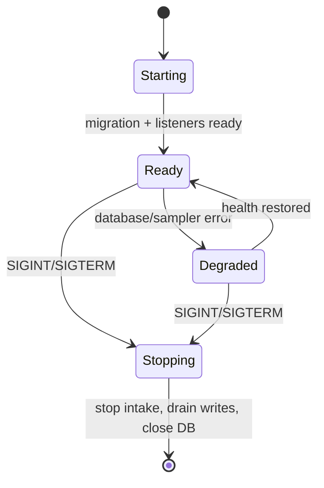

# Daemon Design

## Why Go

Go produces one small host binary, has first-class HTTP/Unix-socket support,
cheap concurrency, predictable memory use, and straightforward macOS/Linux
cross-compilation. The wire protocol and SQLite schema remain language-neutral.

## Modules

| Module | Role |
| --- | --- |
| Event Receiver | Bounded HTTP batches over a `0600` Unix socket |
| Event Validator | Envelope/version/type/time/size enforcement |
| Event Normalizer | UTC timestamps and bounded categorical values |
| Runtime State Reducer | Idempotent lifecycle upserts |
| Process Discovery | Learns PID from verified `gateway.started`; guards PID reuse |
| Resource Collector | Samples process CPU/RSS/VM/thread/FD data every five seconds |
| Metrics Aggregator | Emits low-cardinality counters/gauges/histograms |
| SQLite Repository | WAL, migrations, transactions, indexed queries |
| REST API | Local JSON query surface |
| SSE Stream | Non-blocking one-way notifications with slow-client eviction |
| Prometheus Exporter | `/metrics` text exposition |
| Retention Worker | Downsampling and expiry batches |

## Listeners and frontend separation

- Event ingestion: `~/.openclaw-observatory/observatory.sock`.
- Backend query/metrics: `127.0.0.1:10087` by default.
- Independent web/static proxy: `127.0.0.1:10086` by default.

The daemon no longer embeds frontend assets. `observatory-web` reads a
versioned Vite build from disk, serves `index.html` with `no-cache`, serves
hashed assets as immutable, and proxies REST, SSE, health, and metrics to the
backend. Frontend-only releases therefore require no daemon restart.

The socket parent is `0700` and the socket is `0600`. A localhost HTTP debug
ingestion endpoint is deliberately not exposed. Container scraping requires an
explicit non-loopback listener and trusted firewall.

## Lifecycle and recovery

On startup the daemon runs migrations, enables WAL, and reconciles open rows.
The collector learns a Gateway PID only from a plugin startup event. When the
PID disappears without `gateway.stopped`, the daemon emits `gateway.crashed` and
closes active runs as incomplete. PID reuse is rejected when process-start
evidence changes.

Graceful shutdown stops accepting new events, allows in-flight transactions to
finish, closes SSE clients, removes the socket, and closes SQLite.

## Health

The public `/health` and `/ready` routes are proxied through the web service.
`/health` means the backend process can answer. `/ready` requires a writable database,
bound ingestion socket, and completed migrations. Gateway-down is operational
state, not daemon unready state.
