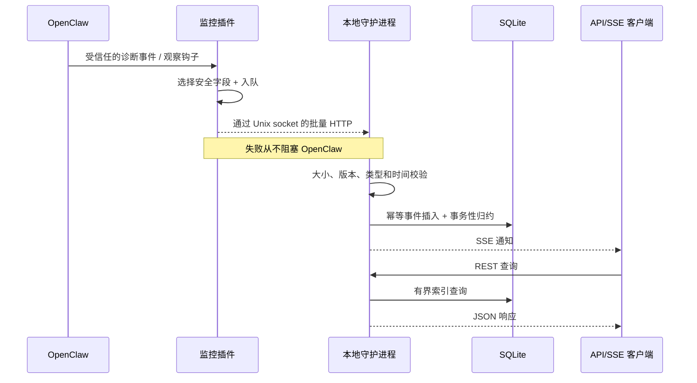

# 架构概览

## 范围

OpenClaw Observatory 是一个本地元数据可观测层。它回答以下问题：

- Gateway 是否存活且有进展？
- 哪些会话和 Agent 运行是活跃的、缓慢的、失败的或不完整的？
- 发生了哪些模型和工具调用，耗时多久，报告了哪些有界核算元数据？
- 在这些活动期间，Gateway 进程消耗了多少 CPU 和内存？

它不检查或回放 Prompt 文本、工具输入/输出、文件内容、Shell 命令或提供商密钥。

## 数据流

## 信任边界

1. OpenClaw 私有诊断数据留在进程内，从不被读取。
2. 插件仅输出显式字段白名单。
3. UDS 目录和数据库是用户私有的；但仍将对端视为不受信任，每个事件都经过校验。
4. HTTP API 默认绑定回环地址。公开绑定是运维操作。
5. Prometheus 只包含聚合和有界维度，不含实体 ID。

## 可用性模型

插件有内存队列，无磁盘依赖。投递方式为最多重试 + 幂等事件 ID。守护进程通过在一个 SQLite 事务中插入事件 ID 并应用归约器，实现有效一次的数据库效果。原始发射在瞬时传输歧义下仍为至少一次。

OpenClaw 崩溃无法发出终止事件。因此，当已知 PID 消失或心跳过期时，守护进程会将 Gateway 标记为崩溃。插件正常关闭时发出 `gateway.stopped`。

## 兼容性

协议独立于 OpenClaw。适配器在启动时记录其 OpenClaw 版本/能力，仅映射已验证的接口。未知的诊断事件会被忽略而非猜测。当前已验证的接口：

- 诊断：运行、模型调用、模型用量、工具执行、心跳；
- 类型化观察钩子：会话生命周期和子 Agent 生命周期；
- 插件服务生命周期：Gateway 启动/停止。

MCP 仅在 OpenClaw 报告 `toolSource: "mcp"` 时进行映射。
