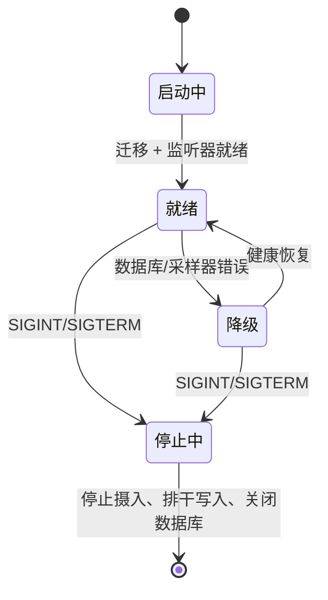

# 守护进程设计

## 为什么选 Go

Go 能产出单个小宿主二进制文件，拥有一流的 HTTP/Unix socket 支持、低开销并发、可预测的内存使用和直接的 macOS/Linux 交叉编译。线路协议和 SQLite Schema 保持语言无关。

## 模块

| 模块 | 职责 |
| --- | --- |
| 事件接收器 | 通过 `0600` Unix socket 的有界 HTTP 批量接收 |
| 事件校验器 | 信封/版本/类型/时间/大小强制校验 |
| 事件规范化器 | UTC 时间戳和有界分类值 |
| 运行时状态归约器 | 幂等生命周期 upsert |
| 进程发现 | 从已验证的 `gateway.started` 学习 PID；防止 PID 复用 |
| 资源采集器 | 每 5 秒采样进程 CPU/RSS/VM/线程/FD 数据 |
| 指标聚合器 | 输出低基数计数器/仪表/直方图 |
| SQLite 仓库 | WAL、迁移、事务、索引查询 |
| REST API | 本地 JSON 查询接口 |
| SSE 流 | 非阻塞单向通知，慢客户端淘汰 |
| Prometheus 导出器 | `/metrics` 文本导出 |
| 保留工作器 | 降采样和过期批处理 |

## 监听器

- 事件摄入：`~/.openclaw-observatory/observatory.sock`。
- 查询/指标：默认 `127.0.0.1:10086`。

Socket 父目录权限 `0700`，socket 文件 `0600`。localhost HTTP 调试摄入端点刻意不暴露。容器抓取需要显式的非回环监听器和受信任的防火墙。

## 生命周期和恢复

启动时，守护进程运行迁移、启用 WAL 并协调未关闭的行。采集器仅从插件启动事件学习 Gateway PID。当 PID 在没有 `gateway.stopped` 的情况下消失时，守护进程发出 `gateway.crashed` 并将活跃运行关闭为不完整。进程启动证据变化时拒绝 PID 复用。

优雅停止时，停止接受新事件，允许进行中的事务完成，关闭 SSE 客户端，移除 socket，关闭 SQLite。

## 健康

`/health` 表示进程可以响应。`/ready` 要求可写的数据库、有界的摄入 socket 和已完成的迁移。Gateway 宕机是运行状态，不是守护进程未就绪状态。
